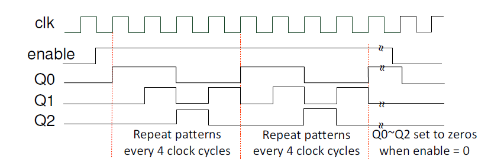
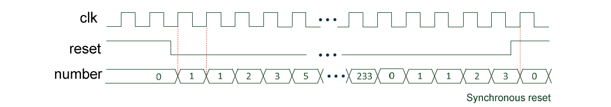
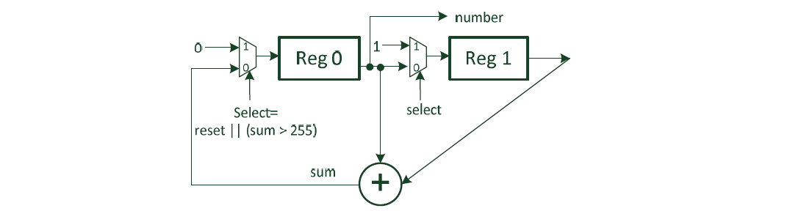
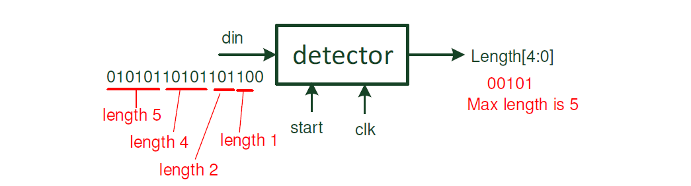

# HDL Final Exam (Programming Part)

### Q1. 2048×8 memory system design
- Please design a 2048×8 memory system consisting of two 1024×4 and two 512×8 single port memory
modules.
- The memory module is addressed by a 11-bit address `addr[10:0]` and has a bi-directional data
port `data[7:0]`. The module has 2 control signals.
- `rw`: write if = 0, read if = 1.
- `cs`: active low chip select signal, the RAM functions only if `cs` = 0. The data port is high impedance
if `cs` = 1
    ```
    module ram2048X8(clk, addr, data, rw, cs);
        input clk, rw, cs;
        input [10:0] addr;
        inout [7:0] data;
    ```

### Q2. Pattern generator
- Design a pattern generator circuit that generates a 4-clock cycle long pattern of `{Q2,Q1,Q0}`
repetitively when `enable` = 1, and resets the pattern when `enable` = 0.
    ```
    module pattern_gen(Q, clk, enable);
        input clk;
        input enable;  /* enable signal for pattern generation */
        output [2:0] Q;
        reg [2:0] Q;  /* 3-bit wide patterns repeat every 4 clock cycles */
    ```
    

### Q3. Fibonacci sequence generator
- The Fibonacci Sequence is a series of numbers: 0, 1, 1, 2, 3, 5, 8, 13, 21, 34, ... The next number
is always equal to summation of the two numbers before it.
- Design a Fibonacci sequence generator that has an initial value 0 after reset (active high), If reset
is removed, the generator starts to output one number every clock cycle. When the number
becomes larger than 255, it turns to 0 and repeats the sequence generation.
    ```
    module fibonacci_generator(clk, reset, number);
        input clk;
        input reset; //active high, synchronous reset
        output [7:0] number;
    ```
    
    


### Q4. Maximum toggle length detection
- Design a detection circuit that detects the the maximum number of consecutive signal transitions
(input data toggles) for an input bit stream of length 32.
- When “start” signal becomes 1 (starting from negative clock edge and valid for 1 clock cycle),
the detector inputs 1 bit every clock cycle and updates the maximum number of consecutive signal
transitions of the admitted bit stream so far.
    ```
    module max_detection(clk,start, din, length);
        input clk;  /* rising edge triggered */
        input start;  /* becomes 1 for 1 clock cycle long at the negative edge of the clock */
        input din;  /* data input port, changes at the negative edges of the clock,
                       and sampled by the detector at the positive edges of the clock */
        output [4:0] length;  /*data output port */
        reg [4:0] length;
    ```
    
- hint：you need a counter, which resets itself if there is no signal transition (data toggle) between two
consecutive clicks and increments if otherwise. You also need a register to keep the current max length.
Each time the input data toggle stops, the counter value is compared with the register value and the
larger one stays.

### Answers
- 100%由我完成，我已經重新檢查過了(皆正確)，供看到這的各位參考。</br>
Have a good day！ :D
