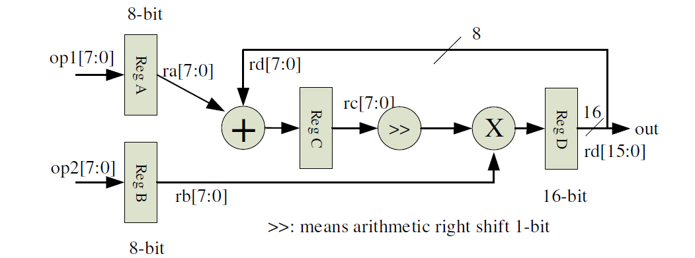

# HDL Midterm Exam (Programming Part)

### Q1. Program debug
- 以下為一ALU設計，請修改以下的(Q1, V code)，使其可以正常compile，並使用Testbench進行模擬。
- Q1, V code：
    ```
    `timescale 1ns/10ps
    module alu(a, b, cmd, y, z, c);
        input [7:0] a, b;  /* input operands */
        input [1:0] cmd;  /* ALU command */
        output [7:0] y;  /* ALU output */
        output c;  /* carry out */
        output z;  /* zero flag */
        reg [1:0] cmd;
        reg [7:0] y;
        reg carry;

        always @(a or b) begin
            case (cmd)
                2'b00: {carry, y} = a + b;
                2'b01: {carry, y} = {1'b0, a - b};
                2'b10: {carry, y} = {1'b0, a || b};
                2'b11: {carry, y} = {1'b0, a & b};
                default: {carry, y} = 9'd0;
            endcase;
        end;

        assign carry = c;
        assign z = (y == 0) ? 1'b1 : 1'b0;
    endmodule
    ```
- Q1, Testbench：
    ```
    `timescale 1ns/10ps
    module Q1_tb;
        reg [7:0] data_a, data_b;
        reg [2:0] command;
        wire [7:0] yout;
        wire z_flag, c_flag;

        alu u1(.a(data_a), .b(data_b), .cmd(command), .y(yout), .z(z_flag), .c(c_flag));

        initial begin
            command = 2'b00;
            data_a = 8'hA3;
            data_b = 8'h65;
            #10 command = 2'b01;
            #10 command = 2'b10;
            data_a = 8'hF0;
            data_b = 8'h0E;
            #10 command = 2'b11;
            #10
            $finish;
        end
    endmodule
    ```

### Q2. Universal counter design
- Design a universal synchronous 4-bit counter with the following features.
- Q2, V code：
    ```
    `timescale 1ns/10ps
    module universal_counter(data, load, incr, pause, clk, count);
        input [3:0] data;  /* set initial value of the counter */
        input load;  /* if load = 1, count[3:0] is set to data[3:0] the positive edge of the clock */
        input incr;  /* up counting if incr = 1, down counting if incr = 0 */
        input pause;  /* counting suspended when pause = 1 */
        input clk;
        output [3:0] count;  /* counter output */
        reg [3:0] count = 4'b0000;  /* register type variable and set initial value 0 */
        
        /* priority of control signals: load > pause */
        /* Counter operates at the positiv edges of the clock */
    ```
- Q2, Testbench：
    ```
    `timescale 1ns/10ps
    module stimulus_counter;
        reg [3:0] data;
        reg clock;
        reg load, incr, pause;
        wire counter;

        universal_counter unit1(data, load, incr, pause, clock, counter);
        initial
            clock = 1'b0;
            always #5 clock = ~clock;  /* Clock period is 10 time units*/
            initial begin
            data = 4'b1100;
            load = 1'b0;
            incr = 1'b1;
            pause = 1'b0;
            #50 load = 1'b1;
            #10 load = 1'b0;
            #50 incr = 1'b0;
            #30 pause = 1'b1;
            #20 load = 1'b1;
            data = 4'b0111;
            #10 pause = 1'b0;
            load = 1'b0;
            #30
            $finish;
        end
    endmodule
    ```

### Q3. Program coding
- Write a Verilog code to describe the pipelined function unit shown below. 
- Q3, V code：
    ```
    `timescale 1ns/10ps
    module pipeline (clk, op1, op2, out);
        input clk;
        input [7:0] op1, op2;
        output [15:0] out;
        wire [15:0] out;  /* DO NOT change it to reg type */

        /* set initial value of all registers to 0 */
        /* all registers are positive edge triggered */
    endmodule
    ```
- Q3, Testbench：
    ```
    module pipelined_test;
        reg [7:0] data1, data2;
        reg clock;
        wire [15:0] data_out;

        pipeline tb1(clock, data1, data2, data_out);

        initial
            clock = 1'b0;
            always #5 clock = ~clock; /* Clock period is 10 time units*/
            initial begin
            data1 = 8’h42; data2 = 8’h21;
            #10 data2 = 8’h42;
            #10 data1 = 8'hA0;
            #00 data2 = 8’h0A;
            #30 $finish;
        end
    endmodule
    ```
