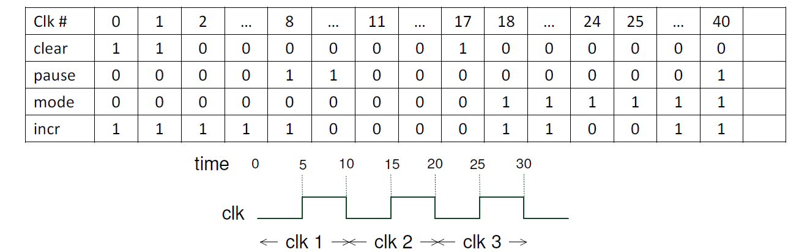

# HDL Homework 3-1 - Counter Design
### Design specs：
- Design a universal synchronous 4-bit counter with the following features：
    - `input clear`：if clear = 1, count[3:0] is reset at the positive edge of the clock.
    - `input mode`：hexadecimal cpounting if mode = 1, decimal counting if otherwise.
    - `input incr`：up counting if incr = 1, down counting if incr = 0.
    - `input pause`：counting suspended when pause = 1.
    - `output [3:0] count`：counter output.
    - `reg [3:0] count`：make `count` register type variable.

- priority of control signals: `clear` > `pause`.
- Counter operates at the positiv edges of the clock.
- Clock period is 10 time units.
- Input waveforms are described in the following table. Clk 0 means initial value at time = 0. All
input signal value changes at the clock cycle boundary, i.e. negative edges of the clock.


### Result (Waves)：


</br></br></br>

# HDL Homework 3-2 - Magnitude Comparator Design
### Design specs：
- First design a 4-bit magnitude comparator. Next construct a 16-bit magnitude comparator design
using following block diagram, i.e., Instantiate five 4-bit comparators and construct a 2-level
comparator network. Use “name mapping” when you instantiate the 4-bit magnitude comparator
modules.
    ```
    module comparator_4b (data_a, data_b, gt, eq, lt)
        input [3:0] data_a, data_b;
        output gt;       /* gt = 1 if data_a > data_b */
        output eq;       /* eq = 1 if data_a == data_b */
        output lt;       /* gt = 1 if data_a < data_b */
        reg gt, eq, lt;  /* declared as register type variables */

    endmodule
    ```


- A. Assume input operands are unsigned (always positive). Each 16-bit input operand is divided into
four 4-bit operands with different weightings. Four separate 4-bit comparisons are conducted
first. A higher weighted comparator always prevails over a lower weighted comparator. We may
use “gt” outputs from the four 4-bit comparators in level 1 to form a 4-bit operand gt[3:0].
Another 4-bit operand lt[3:0] can be likewise obtained. We can then use a 2nd-level 4-bit
magnitude comparator to obtain the final comparison result.

- B. Modify the design obtained in part A by adding delays. Assume the delays from input to outputs
gt, eq and lt are #3, #5 and #4, respectively. What is the longest delay in this simulation and show
the signal propagation path where this longest delay occurs?

### Result (Waves)：
- A (without delay simulation) 
- B (with delay simulation) 
