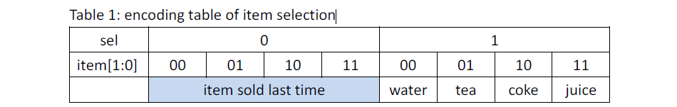
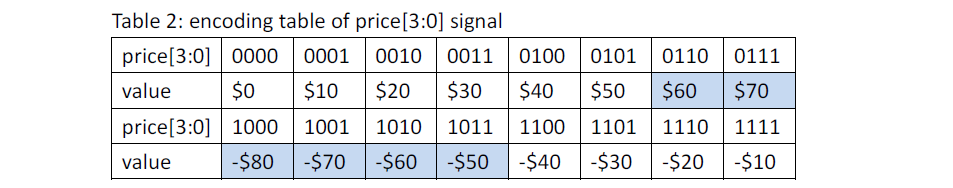
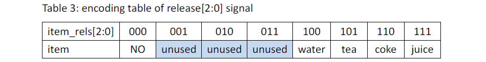
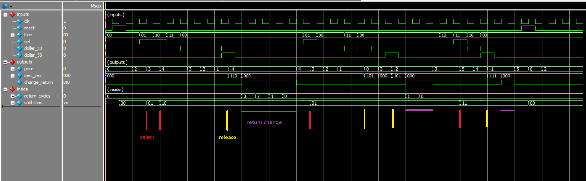

# HDL Homework 4 - Vending Machine Design
### Design specs：
- For an electronic vending machine that sells 4 different items, i.e. bottled water (NT20),  
black tea (NT30), coke (NT40) and juice (NT50). The finite state machine (FSM) operates at  
the positive edges of the clock and can be reset synchronously by a “reset” signal.

- It accepts $10 and $50 coins only. Assume coin input signals “dollar_10” and “dollar_50”  
keep value “1” for only 1 clock cycle, i.e., the signals have been modified by one-shot pulse  
generators and signals change only at the negative edges of the clock cycle.

- To purchase an item, the customer needs to select the item first. The item selection is  
represented by a 2-bit signal “item[1:0]” (“00” for bottled water, “01” for black tea, “10” for  
coke and “11” for juice) along with a selection confirm “sel”. The item selection can be  
overridden as long as “sel” remains 1.

- If no item selection is confirmed before the coin insertion, the default item is the last  
purchased item. Assume “sel” and “item[1:0]” are always entered at the negative edges of  
the clock cycle and “sel” signal lasts for one clock cycle.

- The vending machine will then display the price of the selected item, which is represented  
by a 4-bit 2’s complement signal “signed price[3:0]”.

- For each coin inserted, the display will be updated to show the remaining amount of money  
to be paid. If the total amount of money inserted is greater than the item price, the displayed  
price becomes negative to indicate the amount of money to be returned, i.e., the change.

- The encoding table of price[3:0] is as follow.
Note (1): the encoding for $60, $70, and -$50,-$60, -$70, -$80 will not occur in vending machine operation.  
Note (2): the default display value of vending machine is $0, i.e., the default value of price is 4’b0000.

- When the customer has inserted sufficient amount of money, the item release signals  
“item_rels[2:0]” will be generated for one clock cycle. The encoding table is as follow

- If there is any change to return, the vending machine will generate an N-cycled pulse signal  
“change_return”, where N is the number of $10 coins to return. That is, if the change is $30,  
“change_return” remains high for 3 clock cycles. And one $10 coin will be returned per clock  
cycle as long as the signal is asserted.

- For each coin returned, the display of price[3:0] updates accordingly. Finally, the price[3:0]  
becomes “0000” when the change is completed returned.

### Result (waves)：

