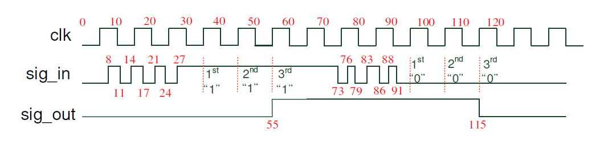
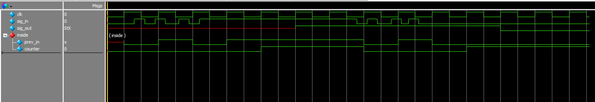
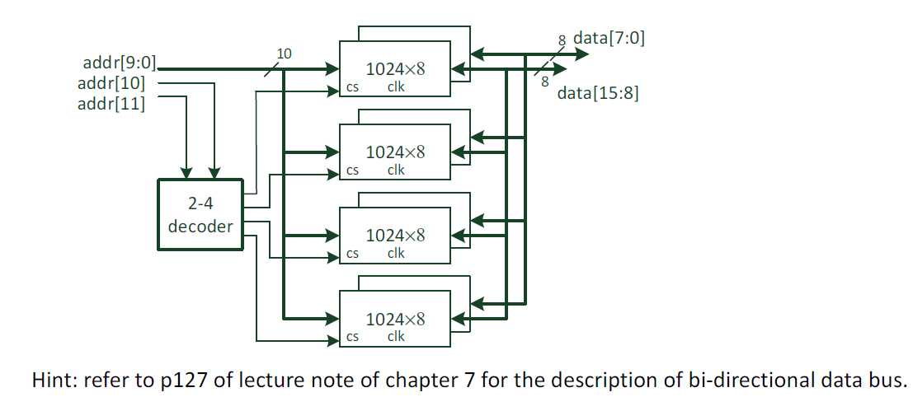
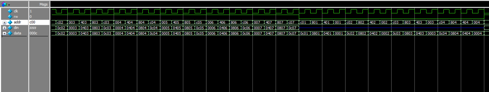
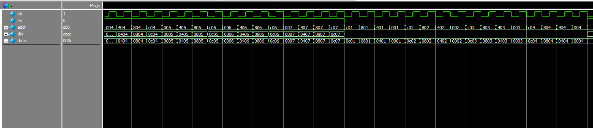

# HDL Homework 5-1 - Debouncing circuit
### Design specs：

Debouncing circuit will sample input signal at the rising edges of the clock and will change its
output state only when a consistent signal is sampled in 3 consecutive clock cycles.

### Result (Waves)：

   

# HDL Homework 5-2 - Memory system
### Design specs：

Please design a 4096X16 memory system consisting of eight 1024X8 single port memory modules.

- The memory module is addressed by a 12-bit address `addr[11:0]` and has a bi-directional data  
port “`data[15:0]`”. The module has 2 control signals
- rw: write if `rw` = 1, read if `rw` = 0
- cs: active low chip select signal, the RAM functions only if `cs` = 0.  
The data port is high impedance if `cs` = 1

The two MSBs `addr[11:10]` are used to select memory module. 
The 16-bit data bandwidth is achieved by concatenating two 8-bit data.

### Result (Waves)：
- ram_testbench： (一部分)
- memory_system_tb： (一部分)
