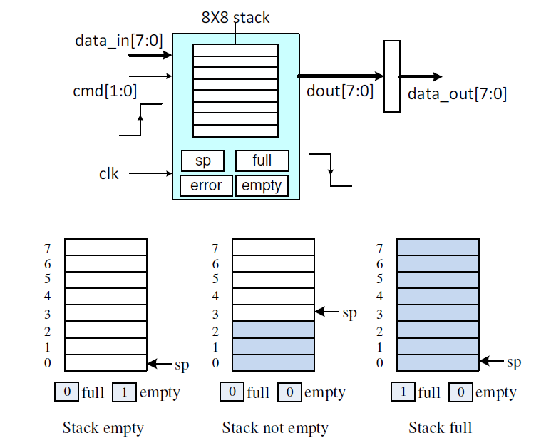
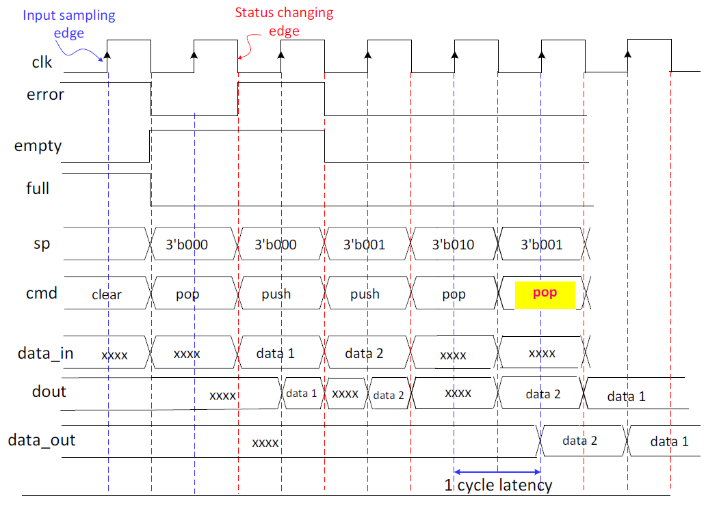

# HDL Homework 6 - Stack Module Design
### Design specs：
- The stack has two I/O ports, data_in[7:0] as input port and data_out[7:0] as output port.

- The stack consists of a memory module of 8X8, a 3-bit stack pointer “sp”, and three stack flags,  
“full” , “empty” and “error”. The stack is initilaized with “sp” set to 3’b000 , flag “empty” set to 1 ,  
flag “full” set to 0 and flag “error” set to 0. The stack pointer always points to the next avaiable  
entry for push operations. The only exception is that “sp” points to the first memory entry (0) when  
the stack is full.

- input “cmd” is 2-bit wide and sampled at the positive edges of the clock. The encoding is as follow：  
`cmd` = `00`: No operation, `01`: clear, `10`: push, `11`: pop

- “data_in” is sampled and stored to the memory module at the positive edges of the clock. Internally,  
stack pointer “sp” is updated at the negative edges of the clock.

- “dout” always reports the content of memory element addressed by “sp”. When “sp” updates (at  
the negative edges of the clock) or new data is writtern in (at the positive edges of the clock), “dout”  
changes accordingly.

- “data_out” is the ouput port of the stack. It is a 8-bit register and always samples dout[7:0] and  
updates at the rising edge of the clock.

- Refer to the timing diagram shown below, each push/pop operation is accomplished in one clock  
cycle. The stack pointer “sp” , three status flags “full” , “empty” and “error” are always updated at  
the negative edges of the clock. Note “data_out” is the only exception, which updates at the rising  
edge of the clock.

- When “push” command is asserted and the stack is not full, a 8-bit data entry will be pushed into  
the stack (wriiten to the memory location pointed by “sp”) at the positive edge of the clock. The  
stack pointer “sp” is then incremented by 1 at the following negative edge of the clock. Nothing  
happens if stack is full, but the “error” flag becomes 1 as long as the “push” command remains.

- When “pop” command is asserted and the stack is not empty, the stack pointer “sp” is decremented  
by 1 at the following negative edge of the clock cycle. The pop out data addressed by “sp” then  
appears in “dout” port. The data is then transferred to “data_out” register at the following positive  
edge of the clock cycle. In other words, the latency between the “pop” command applies and valid  
data appears in “data_out” port is 1 clock cycle. This data retails if “sp” remains unchanged. Nothing  
happens if stack is empty except the “error” flag becomes 1 if the “pop” command applies continuously.

- When “clear” command is applied, the “sp” is reset to 3’b000, the “full” flag is set to 0, “empty”  
flag set to 1, “error” flag is cleared at the next negative edge of the clock.

