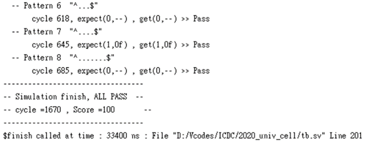

# 2021 IC Design Contest

## <b>題目：</b> String Matching Engine

<br>


## <b>說明：</b>

- <b>題目沒說清楚，總之^跟$沒包含在8以內。</b>

- <b>自訂的變數：</b>
    - ``` reg [1:0] state ```：
        儲存目前的執行狀態，"0"：輸入、"1"：計算、"2"：輸出。

    - ``` reg signed [7:0] str [0:31] ```：
        儲存String使用，最多32字元，所以宣告長度是0~31的陣列。

    - ``` reg signed [7:0] pat [0:9] ```：
        儲存Pattern使用，最多8字元，所以宣告長度是0~7的陣列。(tb.sv的最後一項測資給的Pattern長度到達了9，不確定是否為tb有誤，也可能是最長長度不包含^$字元，故在此多宣告2個空間)

    - ``` reg [5:0] str_ptr ``` & ``` reg [3:0] pat_ptr ```：
        指標，儲存著資料的位置，使用方式如：str[str_ptr] 或 pat[pat_ptr]。(我原本用少1 bit的空間就達到指標的效果，例如：[2:0] pat_ptr，但如果在pat_ptr為0時減1，它不會從0變為7而是被作為-1看待，因此將其多宣告1 bit空間)

    - ``` reg [4:0] str_len ``` & ``` reg [3:0] pat_len ```：
        儲存字串的長度-1，-1的原因是可以少用1 bit。

    - ``` reg flag ```：
        代表目前是否有可能比對成功。

    - ``` reg need_start ```：
        代表Pattern有^字元。
    
    - ``` reg need_end ```：
        代表Pattern有$字元。


<br>


## <b>Behavioral Simulation：</b>

