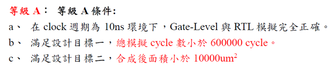

# 2022 IC Design Contest

## <b>題目：</b> Job Assignment Machine

<br>


## <b>說明 ( JAM_ver1 )：</b>

- <b>自訂的變數：</b>
    - ``` reg [6:0] cost_data [0:7][0:7] ```：
        Workers對應Jobs的工作成本表格，為二維陣列、每一個單元有7 bits。

    - ``` reg [2:0] job [0:7] ```：
        第n個Worker的Job = job[n]，為一維陣列、每個單元有3 bits。

    - ``` reg [1:0] state ```：
        儲存目前的執行狀態，"0"：正在輸入、"1"：正在計算、"2"：正在輸出、"3"：(none)。

- <b>初始化：</b>
    - ``` W <= 0 & J <= 0 ```：
        歸零以讓讀入表格資料時，從 (0, 0) 格開始讀入。

    - ``` state <= 0 ```：
        將state歸零，讓電路的狀態從 "正在輸入" 開始。

    - ``` Valid <= 0 ```：
        表示沒有要輸出。

    - ``` MinCost <= 1023 ```：
        將 "最低成本" 設置為可能之最大值，使其與真正計算出來的成本比較後，很容易就能被取代。

    - ``` job[0~7] <= 0~7 ```：
        最初分配給不同工人的工作。

- <b>運作：</b>
    - <b>輸入狀態 (state = 0)：</b>
        正半週改變W與J，決定要讀入的表格；負半週讀入該格的成本。

    - <b>計算狀態 (state = 1)：</b>
        正半週執行 (1)比較並更新當前最低成本 (2)更新符合此最低成本的總方法數 (3)使用字典序演算法重新分配工作給工人；
        負半週依照當前分配的工作方法計算成本。

    - <b>輸出狀態 (state = 2)：</b>
        正半週將電路狀態設為輸出狀態 (題目的附圖是在negedge改變Valid)，負半週將Valid升為1。

<br>


## <b>改進：</b>

- <b>JAM_ver2：</b>
    - <b>改用 next_job 組合邏輯電路獲取下個排序：</b>
        原本是覺得改成組合邏輯電路會快一些 (此指訊號傳遞速度)，但也可能沒有。

    - <b>TotalCost 加法結構對稱：</b>
        將其用( )限制加法的順序，讓它更對稱。

    - <b>表現：</b>
        Cycle數極端少 (40,000)，面積極端大 (Total Cell area: 29423)。


- <b>JAM_ver3.0：</b>
    - <b>更改排序的交換方式</b>：
        原本用大量的if-else使其僅花一個Cycle就完成下個排序，此電路改拆3步驟並逐一尋找index。

    - <b>表現：</b>
        Cycle數以正常而言仍非常少 (280,000)，合成面積不明原因比ver2大 (Total Cell area: 48181)。


- <b>JAM_ver3.1：</b>
    - <b>捨棄暫存</b>：
        捨棄了7個原本共 8x8 的 7bits cost_data，改用 1x8 的7bits cost_data 暫存一種排序的成本；但也造成需要重複從cost_rom 讀取需要的資料，使結構更為複雜。

    - <b>SWAP state 的結束</b>：
        更改結束的判斷條件，使其在每次排序都少了一個cycle，共少了 8! = 40,320 個cycles。

    - <b>表現：</b>
        Cycle數偏少 (320,000)，合成面積偏大 (Total Cell area: 10176)。


- <b>JAM_ver4.0：</b>
    - <b>捨棄暫存</b>：
        完全捨棄了 cost_data 暫存；造成需要更多次重複從cost_rom 讀取需要的資料，花費時間多上許多。

    - <b>表現：</b>
        Cycle數較多 (470,000)，未合成。


- <b>JAM_ver4.1：</b>
    - <b>找尋交換點</b>：
        使其強制在 1 cycle 內找到接下來的交換點，不再逐一尋找。

    - <b>表現：</b>
        Cycle數些微偏多 (400,000)，但合成面積很小 (Total Cell area: 6632)。

</br>

## Result：
- Requirements：</br>


- ver2：</br>


- ver4.1：</br>


